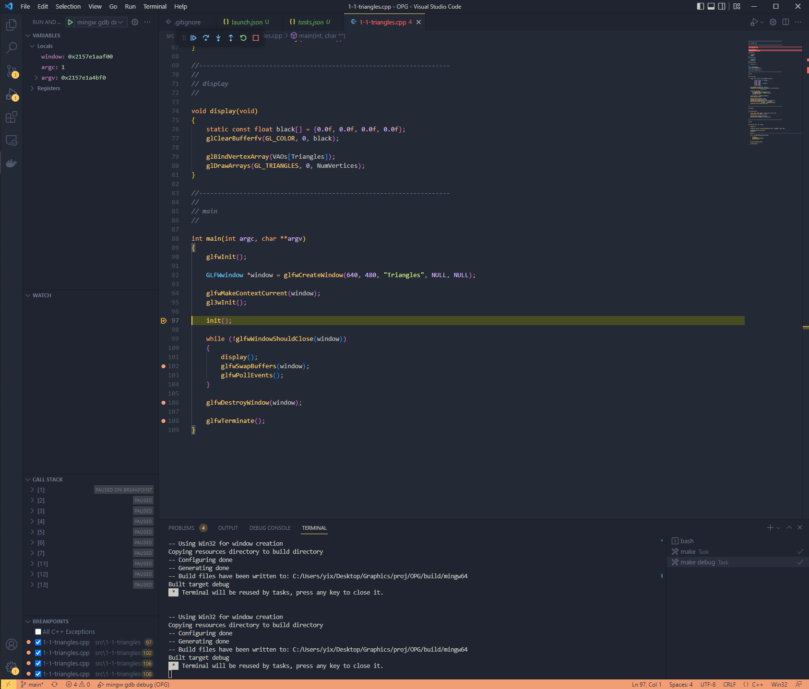
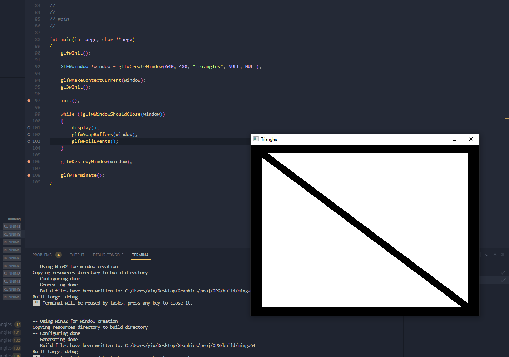
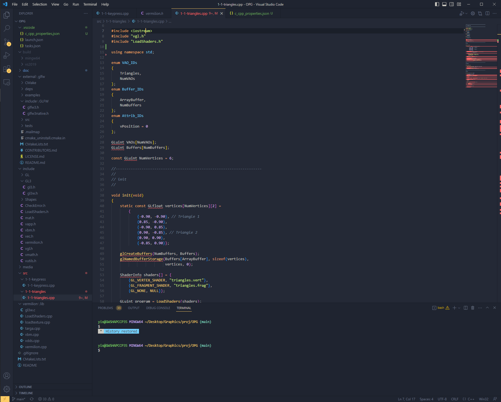

# chapter 0(env prepare):
关于环境，有很多选项，光是编译器就可以使用MinGW、MSVC、GNU等gcc编译器来编译(gnu和mingw编译不通过去看RAEDME的Q&A)，调试的话同理根据选择的编译器有不同的调试方式，MSVC就是vs ide来debug，我目前用的是mingw所以我打算使用gdb来进行debug，编译时注意一下流程：
```sh
yix@GWSHAPCCP35 MINGW64 ~/Desktop/Graphics/proj/OPG/build/mingw64 (main)
$ make debug
-- Using Win32 for window creation
Copying resources directory to build directory
-- Configuring done
-- Generating done
-- Build files have been written to: C:/Users/yix/Desktop/Graphics/proj/OPG/build/mingw64
-- Using Win32 for window creation
Copying resources directory to build directory
-- Configuring done
-- Generating done
-- Build files have been written to: C:/Users/yix/Desktop/Graphics/proj/OPG/build/mingw64
Built target debug
yix@GWSHAPCCP35 MINGW64 ~/Desktop/Graphics/proj/OPG/build/mingw64 (main)
$ make
[  3%] Building C object external/glfw/src/CMakeFiles/glfw.dir/context.c.obj
[  7%] Building C object external/glfw/src/CMakeFiles/glfw.dir/init.c.obj
[ 10%] Building C object external/glfw/src/CMakeFiles/glfw.dir/input.c.obj
[ 14%] Building C object external/glfw/src/CMakeFiles/glfw.dir/monitor.c.obj
[ 17%] Building C object external/glfw/src/CMakeFiles/glfw.dir/vulkan.c.obj
[ 21%] Building C object external/glfw/src/CMakeFiles/glfw.dir/window.c.obj
[ 25%] Building C object external/glfw/src/CMakeFiles/glfw.dir/win32_init.c.obj
[ 28%] Building C object external/glfw/src/CMakeFiles/glfw.dir/win32_joystick.c.obj
[ 32%] Building C object external/glfw/src/CMakeFiles/glfw.dir/win32_monitor.c.obj
[ 35%] Building C object external/glfw/src/CMakeFiles/glfw.dir/win32_time.c.obj
[ 39%] Building C object external/glfw/src/CMakeFiles/glfw.dir/win32_thread.c.obj
[ 42%] Building C object external/glfw/src/CMakeFiles/glfw.dir/win32_window.c.obj
[ 46%] Building C object external/glfw/src/CMakeFiles/glfw.dir/wgl_context.c.obj
[ 50%] Building C object external/glfw/src/CMakeFiles/glfw.dir/egl_context.c.obj
[ 53%] Building C object external/glfw/src/CMakeFiles/glfw.dir/osmesa_context.c.obj
[ 57%] Linking C static library ..\..\..\lib\libglfw3_d.a
[ 57%] Built target glfw
Scanning dependencies of target vermilion
[ 60%] Building C object CMakeFiles/vermilion.dir/vermilion/lib/gl3w.c.obj
[ 64%] Building CXX object CMakeFiles/vermilion.dir/vermilion/lib/LoadShaders.cpp.obj
[ 67%] Building CXX object CMakeFiles/vermilion.dir/vermilion/lib/targa.cpp.obj
[ 71%] Building CXX object CMakeFiles/vermilion.dir/vermilion/lib/vdds.cpp.obj
[ 75%] Building CXX object CMakeFiles/vermilion.dir/vermilion/lib/loadtexture.cpp.obj
[ 78%] Building CXX object CMakeFiles/vermilion.dir/vermilion/lib/vermilion.cpp.obj
[ 82%] Building CXX object CMakeFiles/vermilion.dir/vermilion/lib/vbm.cpp.obj
[ 85%] Linking CXX static library lib\libvermilion_d.a
[ 85%] Built target vermilion
[ 89%] Building CXX object CMakeFiles/1-1-triangles.dir/src/1-1-triangles/1-1-triangles.cpp.obj
[ 92%] Linking CXX executable bin\1-1-triangles_d.exe
[ 92%] Built target 1-1-triangles
Scanning dependencies of target 1-1-keypress
[ 96%] Building CXX object CMakeFiles/1-1-keypress.dir/src/1-1-keypress/1-1-keypress.cpp.obj
[100%] Linking CXX executable bin\1-1-keypress_d.exe
[100%] Built target 1-1-keypress
```
然后理论上你的bin目录应该是这样的：

```txt
bin
    |-/media
    |1-1-keypress_d.exe
    |...
```
"_d"说明生成的程序集是以"-g"编译选项编译得到的，所以接着可以调用gdb(用mingw内部自带的那个就行了)进行古法调参：
```sh
yix@GWSHAPCCP35 MINGW64 ~/Desktop/Graphics/proj/OPG/build/mingw64 (main)
$ gdb ./bin/1-1-triangles_d
GNU gdb (GDB) 11.2
Copyright (C) 2022 Free Software Foundation, Inc.
License GPLv3+: GNU GPL version 3 or later <http://gnu.org/licenses/gpl.html>
This is free software: you are free to change and redistribute it.
There is NO WARRANTY, to the extent permitted by law.
Type "show copying" and "show warranty" for details.
This GDB was configured as "x86_64-w64-mingw32".
Type "show configuration" for configuration details.
For bug reporting instructions, please see:
<https://www.gnu.org/software/gdb/bugs/>.
Find the GDB manual and other documentation resources online at:
    <http://www.gnu.org/software/gdb/documentation/>.

For help, type "help".
Type "apropos word" to search for commands related to "word"...
Reading symbols from ./bin/1-1-triangles_d...
(gdb) b main
Breakpoint 1 at 0x1400016e5: file C:\Users\yix\Desktop\Graphics\proj\OPG\src\1-1-triangles\1-1-triangles.cpp, line 90.
(gdb) r
Starting program: C:\Users\yix\Desktop\Graphics\proj\OPG\build\mingw64\bin\1-1-triangles_d.exe 
[New Thread 36520.0x8dbc]
[New Thread 36520.0x7208]
[New Thread 36520.0x525c]

Thread 1 hit Breakpoint 1, main (argc=1, argv=0x1a673ee5f60) at C:\Users\yix\Desktop\Graphics\proj\OPG\src\1-1-triangles\1-1-triangles.cpp:90
90          glfwInit();
(gdb)
```

不想古法调试的话可以配置一下vscode的tasks.json和launch.json，我将mingw的完整实现放在了.vscode中并且上传了，使用时记得修改当前需要调试的exe路径以及gdb所在的路径。

效果图：


<u>**请务必注意当前还有个小问题，gdb在调试时，假如进程被glfw独占的话，gdb的设置断点极有可能失效或者被block住，如下：**</u>



可以发现当我丢失了对程序的捕获之后，设置的断点都处于block状态（空心白色断点）
你可以参考这个issue来解决这个问题

[Can't bind breakpoint while program is running on Windows](https://github.com/Microsoft/vscode-cpptools/issues/595#issuecomment-289786451)

或者更加直接一点，调用系统层api创建一个新的console

``` cpp
// allocate a new console
AllocConsole();
HWND consoleHandle = GetConsoleWindow();
ShowWindow(consoleHandle, SW_SHOW);
```
在这个console中按下<kbd>Ctrl</kbd>+<kbd>c</kbd>来暂停进程，这样就可以设置断点。顺带提一句在loop中添加
``` cpp
loop
{
    ...
    Sleep(5);
    ...
}
```
并不能使进程暂停，而是处于一个等待的状态，直到5ms后一个信号量通知主线程可以开始执行调度（如果想深入了解可以参考CLR via C#对线程调度一章的讨论）。

那么处理完这些还有最后一个问题，在vscode中配置cpp智能感知。
理论上设置好c_cpp_properties.json就行了(可以参考.vscode目录下的现有配置，根据本地环境更改编译器路径)。
顺带一提直接粘贴书中代码很有可能会重复引用相同头文件，比如第一节就重复引用了
```cpp
#include <iostream>
```
~~这会导致vscode的intellisense出错，像如下这样：~~

其实是vscode智能感知的问题，参考ps里的issue来解决这个问题.


至此，需要配置的东西大体都配置好了，可以进入到正式的代码学习中了。

ps:我在配置时其实还遇到了是不是给我报"namespace "std" has no member "cout""

可以参考这个[issue](https://stackoverflow.com/questions/44094817/why-is-visual-studio-code-telling-me-that-cout-is-not-a-member-of-std-namespace)

# chapter 1:
